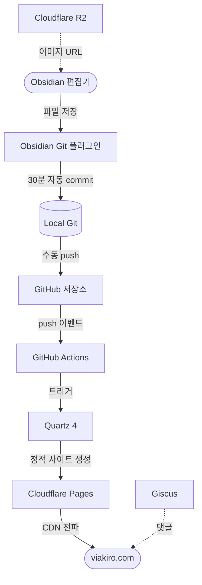

# ✅ Obsidian 블로그 배포

## 1. 프로젝트 개요

Claude Code를 활용해 Obsidian 기반 기술 블로그를 구축하고 자동 배포 파이프라인을 완성한 프로젝트.

Obsidian에서 마크다운으로 글을 작성하면 GitHub Actions가 자동으로 감지해 Quartz 4로 빌드하고 Cloudflare Pages에 배포한다. 글쓰기 이외의 모든 과정이 자동화되어 있다.

**배포 주소**: [viakiro.com](https://viakiro.com)

## 2. 아키텍쳐 구상도

## 3. 주요 기능 정의

| 기능 | 설명 |
|------|------|
| 자동 commit | Obsidian Git이 30분 주기로 변경사항을 자동 commit |
| 수동 push | Cloudflare Pages 무료 빌드(월 500회) 보호를 위해 push는 수동 실행 |
| Draft 관리 | frontmatter `draft: true`로 작성 중인 글을 빌드에서 제외 |
| 이미지 호스팅 | Cloudflare R2에 업로드 후 퍼블릭 URL로 교체 (Git 저장소에 바이너리 미포함) |
| 자동 배포 | `content/**` 변경 감지 시 GitHub Actions → Quartz 빌드 → Cloudflare Pages 배포 |
| 댓글 | Giscus (GitHub Discussions 기반) |

## 4. 스펙 정의

### 기술 스택

| 역할 | 기술 |
|------|------|
| 편집기 | Obsidian |
| 정적 사이트 생성기 | Quartz 4 (Preact 기반) |
| 호스팅 | Cloudflare Pages (무료 티어) |
| CI/CD | GitHub Actions |
| 이미지 스토리지 | Cloudflare R2 (egress 무료) |
| 댓글 | Giscus (GitHub Discussions) |

### Obsidian 플러그인

| 플러그인 | 용도 |
|----------|------|
| Obsidian Git | 30분 자동 commit + 수동 push |
| Templater | 글/폴더 index 템플릿 자동 생성 |
| Image Upload Toolkit | 이미지 → R2 업로드 (수동 트리거) |

### 콘텐츠 규칙

- `content/` root에 파일 직접 저장 금지 → 반드시 카테고리 폴더 안에 저장
- 파일명은 영문 kebab-case (URL slug가 됨)
- frontmatter 필수 필드: `title`, `date`, `tags`, `draft`
