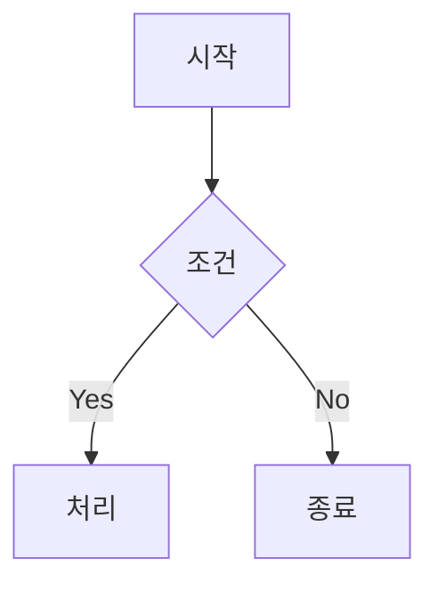

# Obsidian Auto-Deploy Blog PRD

## 1. 프로젝트 목표

**핵심 문제**: Obsidian에서 작성한 노트를 블로그로 게시하려면 매번 수동으로 commit/push/배포해야 하는 번거로움이 있음. 이 과정을 완전 자동화하여 글쓰기에만 집중할 수 있는 환경을 구성.

**성공 기준 (최소 동작 조건)**:
- Obsidian에서 `content/` 폴더 내 파일을 저장하면, 30분 주기로 자동 commit됨
- 작성 완료 후 수동 push → GitHub Actions 트리거 → Quartz 4로 빌드된 정적 사이트가 Cloudflare Pages에 자동 배포됨
- push 후 10분 이내에 블로그에 반영됨

---

## 2. 시스템 구성 요소

### 전체 데이터 흐름

```
[Obsidian 편집기]
  ↓ 파일 저장 (Ctrl+S / 자동 저장)
[Obsidian Git 플러그인]
  ↓ 30분 주기 자동 commit ("auto: {{date}}")
  ↓ 수동 push (Cmd+P → Obsidian Git: Push)
  ↓ git push origin main
[GitHub 저장소]
  ↓ push 이벤트 감지
[GitHub Actions]
  ↓ workflow 트리거 (on: push → main)
  ↓ Node.js 환경 구성 + npx quartz build
[Quartz 4 빌드 결과물 (public/)]
  ↓ Cloudflare Pages 배포 API 호출
[Cloudflare Pages]
  ↓ CDN 전파
[공개 블로그 URL]
```

### 2.1 Obsidian + Obsidian Git 플러그인

| 항목 | 내용 |
|------|------|
| 역할 | 노트 편집 환경 + 자동 commit/push 실행 |
| 사용 기술 | Obsidian (데스크탑), Obsidian Git 플러그인 v2.x |
| 설정 방법 | Community Plugins에서 "Obsidian Git" 검색 후 설치. Vault 루트 = Git repo 루트로 설정 |
| 핵심 설정값 | `autoCommitMessage`, `autoSaveInterval` (30분), push는 수동 |

### 2.2 GitHub 저장소

| 항목 | 내용 |
|------|------|
| 역할 | 노트 파일의 원격 저장소 + CI/CD 트리거 기점 |
| 사용 기술 | GitHub (public 또는 private 저장소) |
| 설정 방법 | 신규 repo 생성 → Obsidian vault 폴더에서 `git init` + remote 연결 |
| 주의사항 | `CLOUDFLARE_API_TOKEN`, `CLOUDFLARE_ACCOUNT_ID`를 Repository Secrets에 등록 필요 |

### 2.3 Quartz 4 (정적 사이트 생성기)

| 항목 | 내용 |
|------|------|
| 역할 | Obsidian 마크다운을 정적 HTML/CSS/JS로 변환 |
| 사용 기술 | Quartz 4 (Node.js 기반, TypeScript 설정 파일) |
| 선택 이유 | Obsidian 문법 네이티브 지원 (wikilinks `[[]]`, callouts, embeds, frontmatter), 별도 변환 플러그인 불필요 |
| 콘텐츠 디렉토리 | Quartz 4 기본 소스 디렉토리는 `content/`. 별도 설정 없이 이 구조를 그대로 사용 |
| 설정 방법 | `npx quartz create` 초기화 후 `quartz.config.ts` 수정 |

### 2.4 GitHub Actions (CI/CD)

| 항목 | 내용 |
|------|------|
| 역할 | push 이벤트 수신 → Quartz 빌드 → Cloudflare Pages 배포 자동화 |
| 사용 기술 | GitHub Actions (ubuntu-latest runner) |
| 트리거 조건 | `on: push` to `main` branch |
| 주요 Action | `actions/checkout@v4`, `actions/setup-node@v4`, `cloudflare/wrangler-action@v3` |

### 2.5 Cloudflare Pages (호스팅)

| 항목 | 내용 |
|------|------|
| 역할 | 정적 사이트 글로벌 CDN 배포 및 서빙 |
| 사용 기술 | Cloudflare Pages (무료 티어) |
| 설정 방법 | Cloudflare 대시보드에서 Pages 프로젝트 생성 → API 토큰 발급 → GitHub Secrets 등록 |
| 무료 티어 제한 | 월 500회 빌드, 무제한 요청, 무제한 대역폭 |

---

## 3. 핵심 기능 요구사항

### F001: 자동 commit + push

| 항목 | 내용 |
|------|------|
| **기능명** | 자동 commit + 수동 push |
| **상세 동작** | 30분 주기 자동 commit. push는 수동 실행 (`Cmd+P` → Obsidian Git: Push). Cloudflare Pages 무료 빌드 500회 한도 보호를 위해 자동 push 비활성화. |
| **커밋 메시지** | `auto: YYYY-MM-DD HH:mm:ss` 형식 |
| **완료 조건** | GitHub 저장소에 커밋 반영 확인 |

### F002: 대상 폴더 필터링

| 항목 | 내용 |
|------|------|
| **기능명** | `content/` 폴더만 push 대상으로 제한 |
| **상세 동작** | `.gitignore`에 "모두 무시 + content 폴더만 허용" 패턴 적용. 개인 노트/초안은 Git 추적 대상에서 완전 제외 |
| **완료 조건** | `git status`에서 `content/` 외 파일이 untracked 또는 ignored로 표시됨 |

### F003: GitHub Actions 자동 빌드 트리거

| 항목 | 내용 |
|------|------|
| **기능명** | push 이벤트 기반 워크플로우 자동 실행 |
| **상세 동작** | `main` 브랜치에 push 발생 시 `.github/workflows/deploy.yml` 워크플로우 즉시 트리거 |
| **완료 조건** | GitHub Actions 탭에서 워크플로우 실행 목록 확인 + 상태 green |

### F004: Quartz 4 빌드 및 Cloudflare Pages 배포

| 항목 | 내용 |
|------|------|
| **기능명** | 정적 사이트 빌드 및 자동 배포 |
| **상세 동작** | `npx quartz build` 실행 → `public/` 폴더 생성 → Cloudflare Pages에 배포 |
| **빌드 시간 목표** | 5분 이내 |
| **완료 조건** | Cloudflare Pages 대시보드에서 배포 상태 "Success" 확인 + 블로그 URL 접속 시 최신 글 반영 확인 |

---

## 4. 비기능 요구사항

| 항목 | 요구사항 | 측정 방법 |
|------|---------|---------|
| **지연 시간** | 수동 push 후 최대 10분 이내 블로그 반영 | Actions 대기/빌드 5분 + CDN 전파 2분 |
| **안정성** | push 실패 시 Obsidian 상태바에 에러 표시 | Obsidian Git 플러그인 기본 동작 |
| **비용** | 무료 티어 범위 내 운영 | GitHub Free: Actions 월 2,000분. Cloudflare Pages: 월 500빌드 |
| **오프라인 대응** | 인터넷 미연결 시 로컬 commit만 누적, 재연결 시 push | Git 기본 동작으로 자동 처리 |

---

## 5. 기술 스택

### 정적 사이트 생성기: Quartz 4

Obsidian 문법(wikilinks, callouts, embeds, frontmatter)을 별도 변환 없이 그대로 렌더링. Obsidian 기반 블로그의 표준 선택지.

### 호스팅: Cloudflare Pages

CDN 성능과 배포 속도 우위. GitHub Actions에서 직접 `wrangler` CLI로 배포하여 빌드 환경 통일.

---

## 6. 디렉토리 구조

```
my-obsidian-vault/              # Obsidian Vault 루트 = GitHub Repo 루트
├── .git/
├── .github/
│   └── workflows/
│       └── deploy.yml
├── .obsidian/                  # gitignore 처리
├── content/                    # 게시 대상 마크다운 (Git 추적 대상)
│   ├── index.md                # 블로그 메인 페이지
│   ├── dev/
│   │   ├── spring-security.md  # 폴더 안이면 파일 직접 저장 OK
│   │   └── react-query.md
│   └── project/
│       └── starterkit.md
├── templates/                  # Templater 템플릿 (gitignore)
│   └── new-post.md
├── private/                    # 개인 노트 (gitignore)
├── quartz.config.ts
├── quartz.layout.ts
├── .gitignore
└── package.json
```

> **폴더 구조 원칙**: `content/` root에 파일을 직접 저장하지 않는다. 최소 한 단계 폴더(카테고리) 안에 넣는다. 폴더 안에 들어온 이후에는 파일을 폴더로 감쌀 필요 없다.

---

## 7. 설정 파일 명세

### 7.1 `.gitignore`

```gitignore
# 기본적으로 모든 것을 무시 (보안: 개인 노트 유출 방지)
/*

# content 폴더만 Git 추적 허용 (블로그 게시 대상)
!/content/
!/docs/

# 빌드/배포 설정 파일 허용
!/.gitignore
!/.github/
!/quartz/
/quartz/.quartz-cache/
!/quartz.config.ts
!/quartz.layout.ts
!/package.json
!/package-lock.json
!/tsconfig.json
```

### 7.2 `.obsidian/plugins/obsidian-git/data.json`

```json
{
  "commitMessage": "auto: {{date}}",
  "autoCommitMessage": "auto: {{date}}",
  "commitDateFormat": "YYYY-MM-DD HH:mm:ss",
  "autoSaveInterval": 0,
  "autoPushInterval": 0,
  "autoPullInterval": 0,
  "autoPullOnBoot": false,
  "disablePopups": false,
  "showStatusBar": true,
  "syncMethod": "merge",
  "autoBackupAfterFileChange": true,
  "changesBeforeCommit": 0
}
```

### 7.3 `.github/workflows/deploy.yml`

```yaml
name: Deploy Blog to Cloudflare Pages

on:
  push:
    branches:
      - main
    paths:
      - 'content/**'
      - 'quartz.config.ts'
      - 'quartz.layout.ts'
      - 'package.json'
      - '.github/workflows/**'

jobs:
  build-and-deploy:
    runs-on: ubuntu-latest
    timeout-minutes: 15

    steps:
      - name: Checkout repository
        uses: actions/checkout@v4
        with:
          fetch-depth: 0

      - name: Setup Node.js
        uses: actions/setup-node@v4
        with:
          node-version: '22'
          cache: 'npm'

      - name: Install dependencies
        run: npm ci

      - name: Build with Quartz
        run: npx quartz build

      - name: Deploy to Cloudflare Pages
        uses: cloudflare/wrangler-action@v3
        with:
          apiToken: ${{ secrets.CLOUDFLARE_API_TOKEN }}
          accountId: ${{ secrets.CLOUDFLARE_ACCOUNT_ID }}
          command: pages deploy public/ --project-name=blog --commit-dirty=true
```

---

## 8. 완료 현황

### 인프라 & 배포

- [x] Obsidian Git 플러그인 설치 및 자동 commit 설정
- [x] `.gitignore`로 `content/` 폴더만 추적 대상 지정
- [x] GitHub 저장소 생성 및 Secrets 등록
- [x] Quartz 4 초기화 및 `quartz.config.ts` 기본 설정
- [x] GitHub Actions 워크플로우 (`deploy.yml`) 작성
- [x] Cloudflare Pages 프로젝트 생성 및 API 토큰 발급
- [x] `viakiro.com` 커스텀 도메인 연결
- [x] `draft: true` frontmatter로 게시 제외 기능
- [x] 댓글 기능 (Giscus — GitHub Discussions 연동)
- [x] `docs/` 폴더 GitHub 추적 + 블로그 제외

### 디자인

- [x] 폰트: Schibsted Grotesk (header) / Source Sans Pro (body) / JetBrains Mono (code)
- [x] 사이트 제목: "📝 Ref's Blog"
- [x] 프로필 이미지 좌측 사이드바 추가
- [x] Search 버튼 디자인 (배경색, 아이콘 우측 배치)
- [x] Explorer active 색상 제거 → hover에만 적용
- [x] UI 텍스트 한글 → 영어 변환 (ko-KR.ts)
- [x] 모바일 헤더: 햄버거 버튼 우측 배치, 프로필 이미지 숨김
- [x] 우측 사이드바: Graph View + TOC + Backlinks
- [x] Explorer 이름 → "Contents"로 변경
- [x] 날짜/읽기 시간 (ContentMeta) 숨김

### Obsidian 플러그인

- [x] Cloudflare R2 + Image Upload Toolkit 설정 (이미지 외부 호스팅)
- [x] Templater 설정 (new-post / folder-index 템플릿)
- [x] Obsidian 첨부 파일 기본 저장 폴더 → `assets/` 지정

---

## 9. 콘텐츠 작성 워크플로우

### 글 작성 프로세스

```
Obsidian에서 Templater로 새 글 생성 (draft: true)
    ↓
글 작성 완료 → draft: false 변경
    ↓
Obsidian Git 자동 commit (30분 주기) → 수동 push (Cmd+P)
    ↓
GitHub Actions → Quartz 빌드 → Cloudflare Pages 배포
    ↓
viakiro.com 반영 (저장 후 최대 10분)
```

### 태그 전략

| 태그 | 용도 |
|------|------|
| `dev` | 기술 글 (언어, 프레임워크, 아키텍처) |
| `project` | 프로젝트 회고 |
| `study` | 개념 정리, 학습 노트 |
| `til` | Today I Learned |

- 태그 총 4개 이하로 유지. 포스트 당 1~2개.

### Git 커밋 컨벤션

```
feat: [dev] spring-security 정리
fix: [project] starterkit 회고 내용 수정
chore: 블로그 설정 변경
```

---

## 10. Obsidian 플러그인 설정

### 10.1 Cloudflare R2 + Image Upload Toolkit (이미지 관리)

이미지를 Cloudflare R2에 업로드하고 R2 퍼블릭 URL로 마크다운 링크를 교체. Git 저장소에 바이너리를 쌓지 않아 저장소 크기를 통제할 수 있다. R2는 egress 무료로 비용 부담 없음.

**설치**: Community plugins → **"Image Upload Toolkit"** 검색 후 설치 → Enable

**Cloudflare R2 버킷 준비**:
1. Cloudflare 대시보드 → R2 Object Storage → **Create bucket** (`blog-images`)
2. 버킷 → **Settings** → **Public access** → Enable (블로그에서 이미지 접근 가능하게)

**R2 API 토큰 발급**:
1. R2 Object Storage → **Manage R2 API Tokens** → **Create API token**
2. 권한: `Object Read & Write`, 버킷: `blog-images`
3. 생성 직후 표시되는 **Access Key ID**와 **Secret Access Key** 반드시 복사 (이후 재확인 불가)

**핵심 설정** (Settings → Image Upload Toolkit → Image Store):

| 설정 항목 | 값 |
|---|---|
| Image store | `Cloudflare R2` |
| Cloudflare R2 Access Key ID | 발급받은 Access Key ID |
| Cloudflare R2 Secret Access Key | 발급받은 Secret Access Key |
| Cloudflare R2 Endpoint | `https://<ACCOUNT_ID>.r2.cloudflarestorage.com` |
| Cloudflare R2 Bucket Name | `blog-images` |
| Target Path | `/{year}/{mon}/{filename}` |
| R2.dev URL | R2 버킷 Public URL (예: `https://pub-xxxx.r2.dev`) |

**사용 방법** (자동 업로드 미지원, 수동 트리거):
1. 이미지 붙여넣기/드래그 → `assets/` 폴더에 로컬 저장
2. 글 작성 완료 후 `Cmd+P` → **"Upload images in current note"** 실행
3. 마크다운 링크가 R2 URL로 자동 교체됨

편의를 위해 Hotkeys에서 `Image upload toolkit: Upload all images` 단축키 등록 권장 (예: `Cmd+Shift+U`)

**Obsidian 첨부 파일 저장 폴더 설정**:

Settings → **Files & Links** → **Default location for new attachments** → `In the folder specified below` → `assets`

이미지 붙여넣기 시 vault root 대신 `assets/` 폴더에 정리됨.

---

### 10.2 Templater 플러그인 (글 작성 템플릿)

커뮤니티 플러그인. 동적 변수(현재 폴더명, 날짜, 파일명 등)를 템플릿에서 자동 삽입. 글 템플릿과 폴더 index 자동 생성 두 가지 용도로 사용.

**설치**: Community plugins → **"Templater"** (개발자: SilentVoid13) → Install → Enable

> 내장 Templates 플러그인과 충돌. 내장 Templates는 비활성화할 것.

**핵심 설정** (Settings → Templater):

| 설정 항목 | 값 |
|---|---|
| Template folder location | `templates` |
| Trigger Templater on new file creation | OFF |

---

**템플릿 1 — 새 글** (`templates/new-post.md`):

```markdown
---
title: <% tp.file.title %>
date: <% tp.date.now("YYYY-MM-DD") %>
tags:
  -
description:
draft: true
---

```

**템플릿 2 — 폴더 index** (`templates/folder-index.md`):

```markdown
---
title: <% tp.file.folder(true).split('/').pop() %>
---
```

- `tp.file.title` → 파일명을 title로 자동 삽입
- `tp.date.now("YYYY-MM-DD")` → 생성 시점 날짜 자동 삽입
- `tp.file.folder(true).split('/').pop()` → 현재 폴더명을 title로 자동 삽입

---

**사용 방법**:

새 글 작성:
1. `Cmd+P` → `Templater: Create new note from template` → `new-post.md` 선택
2. 파일명 입력 → 원하는 카테고리 폴더로 이동

새 카테고리 폴더 index 생성:
1. 폴더 생성 후 그 안에 `index.md` 파일 직접 생성
2. `Cmd+P` → `Templater: Open Insert Template Modal` → `folder-index.md` 선택

Hotkeys에서 `Templater: Create new note from template`에 단축키 바인딩 권장 (예: `Alt+N`)

---

**Quartz RemoveDrafts 연동**:

```
새 글 생성 (draft: true) → 작성 완료 → draft: false → push → 자동 배포
```

**주의사항**:
- `date` 필드는 `YYYY-MM-DD` 형식 유지 (Quartz 파싱 기준)
- `templates/` 폴더는 `.gitignore`로 이미 Git 추적 제외됨

---

### 10.3 Mermaid 다이어그램

Quartz 4가 Mermaid.js를 기본 내장하므로 별도 플러그인 없이 배포 환경에서 렌더링된다.

````markdown

````

Obsidian에서 보이는 것과 동일하게 블로그에서도 렌더링된다. `quartz.config.ts`의 `ObsidianFlavoredMarkdown` 플러그인이 활성화되어 있으므로 추가 설정 불필요.

> **Image Upload Toolkit의 "Convert Mermaid diagrams to images" 옵션**: Mermaid를 PNG로 변환해 R2에 올리는 기능. Quartz 자체 렌더링이 이미 지원되므로 켜지 않아도 된다.

---

## 11. 트러블슈팅 가이드

### 11.1 Git 인증 오류 (macOS Keychain 설정)

**증상**: Obsidian Git 플러그인에서 push 시 "Authentication failed" 에러 표시

**해결 방법 (SSH 방식 권장)**

```bash
# 1. SSH 키 생성
ssh-keygen -t ed25519 -C "your@email.com"

# 2. 공개키를 GitHub에 등록
# GitHub → Settings → SSH and GPG keys → New SSH key
cat ~/.ssh/id_ed25519.pub

# 3. Remote URL을 SSH 방식으로 변경
git remote set-url origin git@github.com:username/my-blog.git

# 4. 연결 테스트
ssh -T git@github.com
```

### 11.2 GitHub Actions 빌드 실패 디버깅

**확인 순서**:
1. Actions 탭 → 실패한 job 클릭 → 로그에서 에러 메시지 확인
2. `CLOUDFLARE_API_TOKEN`, `CLOUDFLARE_ACCOUNT_ID` Secrets 값 재확인
3. `npm ci` 실패 시 `package-lock.json`이 repo에 포함되어 있는지 확인
4. Quartz 빌드 실패 시 로컬에서 `npx quartz build`로 재현 후 디버깅
